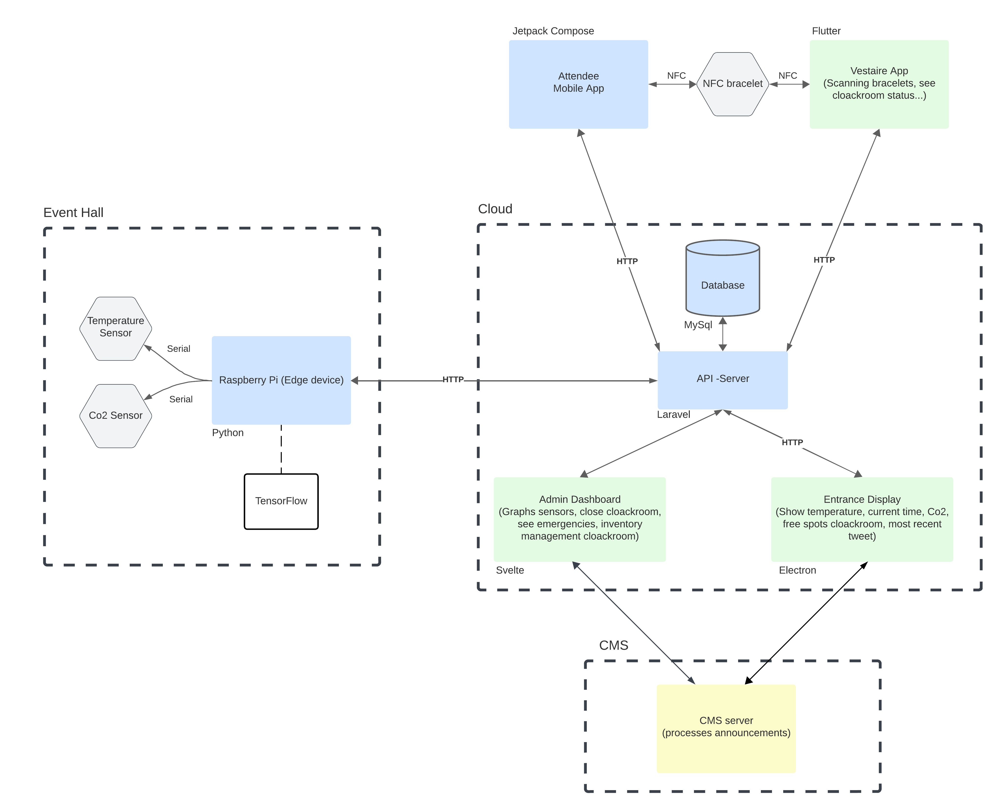

# Eventiz: A Project by Lukas Olivier & Niels Soete for the CCETT Module

Introducing "Eventiz" – the future of event management and attendee experience. Eventiz is a smart mobile application that provides real-time information about the environment within an event hall, simplifies attendee check-in with bracelet integration, and prioritizes safety through an emergency alert system. With Eventiz, users can easily monitor CO2 levels and temperature in the event space, ensuring a comfortable and safe atmosphere. The app's bracelet-linking feature streamlines the process of locating clothes storage racks, making event attendance more convenient and efficient. Additionally, Eventiz includes an emergency button that sends the user's location to first responders in case of emergencies, boosting event safety.

## Repositories

- [Svelte - Admin Application](https://gitlab.ti.howest.be/ti/2023-2024/s5/ccett/projects/group12/code/admin-application-svelte)
- [Laravel - API / Websockets server](https://gitlab.ti.howest.be/ti/2023-2024/s5/ccett/projects/group12/code/laravel)
- [Strapi - CMS](https://gitlab.ti.howest.be/ti/2023-2024/s5/ccett/projects/group12/code/cms-strapi)
- [Android - Guest Application](https://gitlab.ti.howest.be/ti/2023-2024/s5/ccett/projects/group12/code/android)
- [Flutter - Cloakroom Application](https://gitlab.ti.howest.be/ti/2023-2024/s5/ccett/projects/group12/code/inventory-management-application)
- [Python - Sensor Reader](https://gitlab.ti.howest.be/ti/2023-2024/s5/ccett/projects/group12/code/sensor-reader-raspberry-pi)
- [Electron - Visitor Information Application](https://gitlab.ti.howest.be/ti/2023-2024/s5/ccett/projects/group12/code/visitor-information-application)

## Deliverables

### CMS

- [x] **Implement a headless CMS to centralize cloud data storage:**
  Announcements are stored in Strapi CMS, while other data resides in the Laravel API server, a decision approved by Ms. Audenaert and Mr. Koreman.

- [x] **Enforce CRUD operations through the CMS system for all endpoints:**
  Event managers can POST new announcements, and the guest application can GET announcements for user display.

- [x] **Visualize CMS-stored data through a frontend (e.g., web shop, blog):**
  Announcements are displayed on event screens.

- [x] **Utilize TensorFlow in an application for data consumption from the CMS, e.g., for object recognition or logging training metrics:**
  Tensorflow processes sensor values on Raspberry Pi, a decision approved by Mr. Koreman.

### Cloud & Edge Computing

- [x] **Utilize a minimum of 2 devices (e.g., Raspberry Pi, Android phone):**
  Our setup includes a Raspberry Pi 4 and an Android phone.

- [x] **Leverage WiFi for inter-device communication using HTTP:**
  Devices communicate using HTTP REST API.

- [x] **Equip each device with at least two different sensors:**
  Raspberry Pi has temperature and CO2 sensors, while the Android device uses NFC and a GPS sensor.

- [x] **Continuously sample and monitor at least one type of data on the cloud platform (e.g., measure temperature every 30 seconds):**
  Raspberry Pi measures temperature and CO2 every 30 seconds, sending data to the Laravel API server.

- [x] **Incorporate Edge Computing with device-to-device actions using a protocol other than HTTP (e.g., MQTT, AMQP, Matter):**
  Edge computing involves checking sensor values; Websockets are employed for real-time information. This is sent to the Laravel websocket server alongside the API server.

- [x] **Define an event triggered by sensor data that prompts user notification (e.g., low air quality):**
  Users receive notifications on the Android app when critical sensor values are detected.

- [x] **Define an event initiated by the user causing a device to take action (e.g., emergency button):**
  Event manager's emergency button triggers an 'alarm' (LED on Raspberry Pi).

- [x] **Define an event triggered by the cloud platform causing a device to take action (e.g., emergency signal for dangerous sensor values):**
  Laravel, upon detecting prolonged dangerous sensor values, sends an emergency signal (LED on Raspberry Pi).

- [x] **Perform computations in the cloud beyond database operations (e.g., calculate daily statistics):**
  Average sensor values are displayed on the statistics panel of the event manager application.

- [x] **Use Kotlin Jetpack Compose, Python, or C on Android, Arduino, or Raspberry Pi (exceptions with lecturer approval only):**
  Python on Raspberry Pi and Jetpack Compose on Android.

### Trending Topics

- [x] **Develop an application for each team member with a unique use case, utilizing different programming languages or concepts:**
  - Niels: Visitor panel using Electron, receiving data from the message broker.
  - Lucas: Cloakroom app using Flutter, sending/receiving rack info.
  - Lukas: Event manager dashboard using SvelteKit, sending rack info and receiving sensor info.

### Global

- [x] **Implement auto-deployment for CMS and Trending Topics applications:**
  Svelte (admin application), Laravel (API server), and Strapi (CMS) are seamlessly built, containerized, and deployed on our Raspberry Pi-hosted cloud platform.

## Technical

In the C4 Diagram below you are able to see how our applications and devices are communication with each other. 

For a more in-depth understanding of how each application or device communicates, please consult the README file within its respective repository.

### C4 Diagram

### Deployment on Cloud Platform

Our cloud infrastructure operates on a Raspberry Pi 4. The Raspberry Pi runs on [Ubuntu Server](https://ubuntu.com/server) and is equipped with [Docker](https://www.docker.com/) and [Portainer](https://www.portainer.io/) for streamlined application management and containerization. This setup enables efficient deployment and ensures the robustness of our applications.

Each repository incorporates CI/CD pipelines that automate the build, containerization, and deployment processes directly onto the Raspberry Pi. The applications are securely exposed to the internet through [Cloudflare Tunnels](https://developers.cloudflare.com/tunnels), enhancing accessibility while maintaining security.

For more information on the specific deployment processes, consult the README files within the individual repositories.

## Contributors

Our collaborative efforts have been led by:

- [Lukas Olivier](https://www.linkedin.com/in/lukas-olivier/)
- [Niels Soete](https://www.linkedin.com/in/niels-soete/)
- [Lucas Guillemyn](https://www.linkedin.com/in/lucas-guillemyn-2b060b291/)

